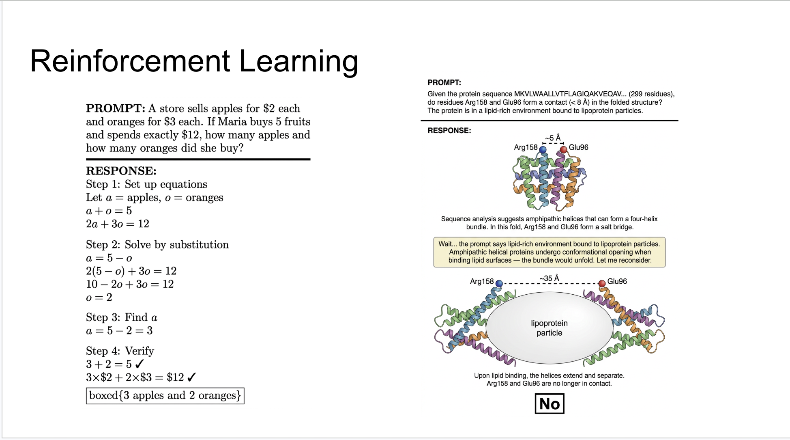

# TODO
Think more carefully about architecture, training data, and evaluation tasks.

Brandon:
1. How to fight catastrophic forgetting? Perhaps make it closer to vanilla transformer so I can use LoRA?
2. How to deal with PBC? I think probably manual data augmentation by creating mirror cells, or chain of thought doing this automatically.
Besides architecture, another problem is data, and it's a huge problem.

Also on evaluation, what task is optimal for demonstrating our motivation? The best task may be something with little data so few/zero shot generalization is preferred, or some tasks that involve inherent ambiguity in its specification so the flexibility of text is needed.

# History
Originally I designed a transformer for MD trajectories.
Zack suggested it should be applicable to all atomic, or even macroscopic, point clouds.
Then I changed it to a generative equivariant transformer.
Brandon and Ray suggested we can drop equivariance entirely.

# Motivation

A multimodal-native LLM, with chemistry as first-class citizen.

A model that can communicate with us, while thinking in a fundamentally non-linguistic way.

Not a replacement for UMA — a complementary multitask, in-context learner.

First class citizen: not as text, vision or tool calls, chemistry deserves its own proper representation. LLMs can summarize a paragraph, it should be able to create coarse grain model of a system. Reason in words, now it can reason in atoms as well. Mirroring the microscopic atomic world; analogous to ideas like "visual thinking", "spatial memory", "sixth sense".

# Architecture
Each token can be a text token, a real number, or a vector.

Following recent studies, equivariance is not necessary.
Identical to a vanilla transformer, except for the embedding and prediction head for real numbers and vectors.

Parameterization is compatible with the vanilla transformer — initialized from pretrained weights for free prior knowledge.

For decoding, reserve a special `<|vectortoken|>`; when it is sampled, draw the next token from a 3D Gaussian instead.

I would argue a likelihood-based distribution loss is better than regression loss, so both text and vector prediction are measured in bits of entropy.

# Related Work
AF3 dropped equivariance.

[molxformer](../reading/2025/molecule_transformer_without_graph.md) dropped graph structure as well.
Interesting that their conclusion is that no prior is needed, except for continuous representation.

However, they use GPT-style pretraining + BERT-style finetuning, with two different tokenization strategies, sacrificing the ability to do generative modeling.
We should also use a distribution loss instead of regression.
This paper is a good baseline and starting point.

# Pretraining
The idea is simple. The key is scaling.

We look for data that are usually excluded from LLM training: MLIP force fields, MD trajectories, XYZ/PDB structures …

Curate a mix covering different
- force model, integrator
- ensemble, thermodynamic state
- system composition and scale
- any metadata or text we find with it (e.g. data source, timestamp …)

Feed it with everything we have.

# Fine-tuning
## Transformer Philosophy
Minimal data assumption with maximal versatility (The Bitter Lesson).

Treat all vectors as coordinates.

Global causal attention.

Unable to model fine-grained large systems beyond the ~1M context window.
May also include point clouds for macroscopic systems; what's special about chemistry is locality, and we can generate data via computation.

Lean towards this during pretraining.

## Physics Priors
Utilize physics priors for scalability and tighter hypothesis space: the cost is more data constraints and labeling.

Label vectors and group features (velocity, force…) by coordinates in training data.

Local interactions for scalability.

Markovian property for temporal sparsity.
High-quality paired data (like structure data and the paper that introduced it).

Lean towards this during posttraining.

## Reinforcement Learning
Supervised learning: learn from data. RL: fill the missing part necessary for explaining but missing from data (only question and answer in dataset), where no supervision signal is available.

This allows the model do something very different from UMA. Add atoms and timesteps for periodic boundary conditions, temporal interpolation, spatial extension, explicit solvent…

Notice that the model does not generate the structure by calling some tool. The ability to understand and generate structure is built in since pretraining, allowing it to be used flexibly per instructions. The lipoprotein particle is ambiguous; specifying it accurately is challenging and not necessary.

Notice that the prompt must contain coordinates that specify a frame of reference, otherwise we cannot generate a non-zero vector from invariant text.

# Phase 1: Pretraining and Finetuning
Reproduce a simplified UMA.

1. Build the transformer decoder (1 week). <!-- TODO: earlier the doc says we drop equivariance; was previously "Equivariant Transformer Decoder". Confirm intended scope. -->

2. Obtain data and pretrain (>4 weeks, hard to estimate).

3. Finetune.

# Phase 2: Ablation and Evaluation

If the vector model helps: compare against an invariant transformer with a vector head.

If the text pretraining helps: compare against random initialization without text pretraining.

# Downstream Tasks
Molecular dynamics.
Structure prediction.
Property prediction and classification.

Agentic-oriented tasks.
Suggest data points where UMA is bad and explain why?

# Phase 3: Reinforcement Learning
RL for longer-timescale, coarse-grained problems.

Pure text problems, with vectors as latent only.

Interpretability of chain of thought reasoning.
